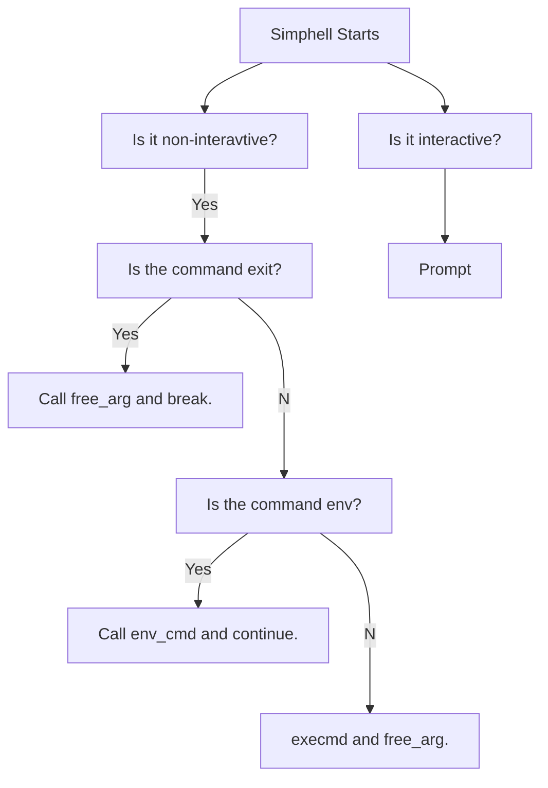

My first readme

```mermaid
flowchart TD;
  A[Simphell Starts]-->B[Is it interactive?];
  A-->C[Is it non-interavtive?];
  C--Yes-->D[Is the command exit?];
  D--Yes-->E[Call free_arg and break.];
  D--No-->F[Is the command env?];
  F--Yes-->G[Call env_cmd and continue.];
  F--No-->H[execmd and free_arg.];
  B-->I[Prompt];
```
