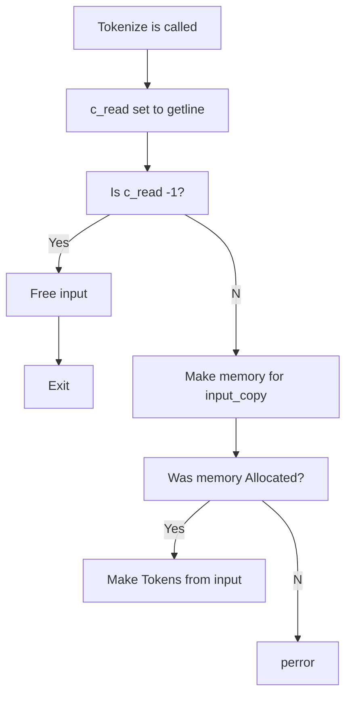

My first readme

```mermaid
flowchart TB;
  A[Tokenize is called]-->B[c_read set to getline];
  B-->C[Is c_read -1?];
  C--Yes-->D[Free input];
  D-->E[Exit];
  C--No-->F[Make memory for input_copy];
  F-->G[Was memory Allocated?];
  G--No-->H[perror];
  G--Yes-->I[Make Tokens from input];
```
