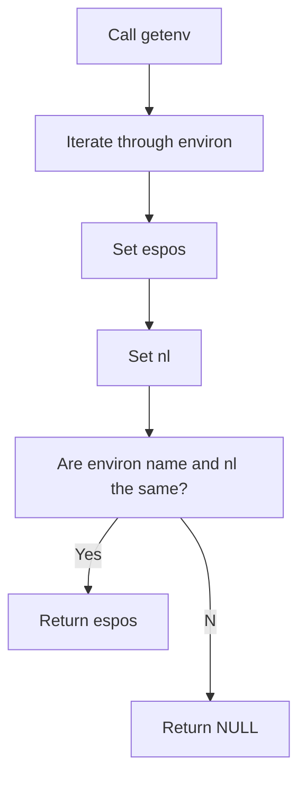

My first readme

```mermaid
flowchart TD;
  A[Call getenv]-->B[Iterate through environ];
  B-->C[Set espos];
  C-->D[Set nl];
  D-->E[Are environ name and nl the same?]
  E--Yes-->F[Return espos];
  E--No-->G[Return NULL];
```
