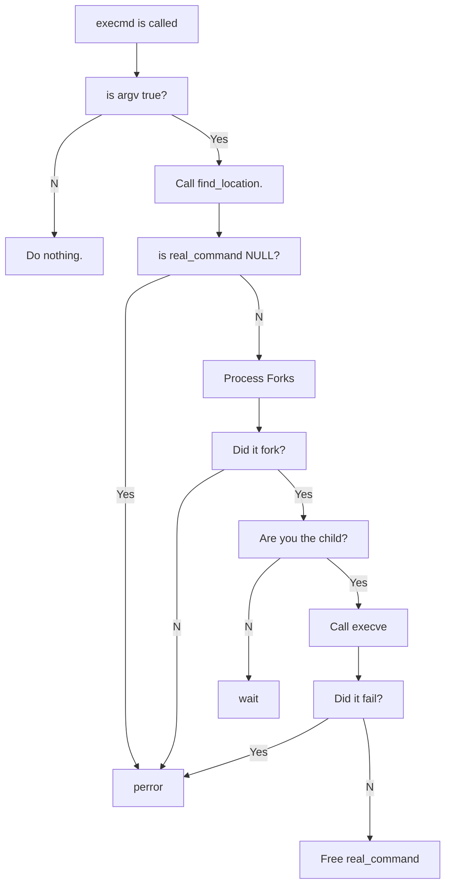

My first readme

```mermaid
flowchart TD;
  A[execmd is called]-->B[is argv true?];
  B--No-->C[Do nothing.];
  B--Yes-->D[Call find_location.];
  D-->E[is real_command NULL?];
  E--Yes-->F[perror];
  E--No-->G[Process Forks];
  G-->H[Did it fork?];
  H--No-->F;
  H--Yes-->I[Are you the child?];
  I--No-->J[wait];
  I--Yes-->K[Call execve];
  K-->L[Did it fail?];
  L--Yes-->F;
  L--No-->M[Free real_command];
```
