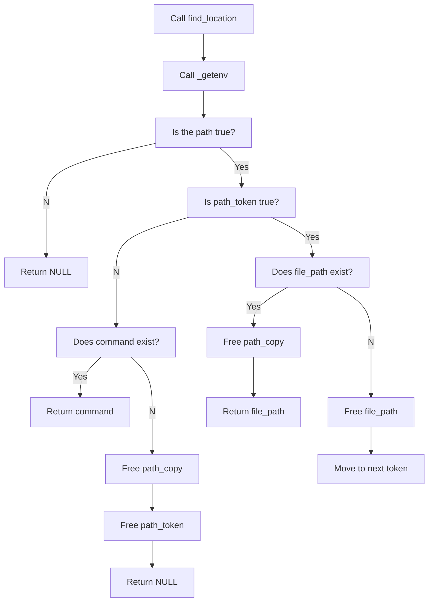

My first readme

```mermaid
flowchart TD;
  A[Call find_location]-->B[Call _getenv];
  B-->C[Is the path true?];
  C--No-->D[Return NULL];
  C--Yes-->E[Is path_token true?];
  E--No-->F[Does command exist?];
  E--Yes-->G[Does file_path exist?];
  F--Yes-->H[Return command];
  F--No-->I[Free path_copy];
  I-->J[Free path_token];
  J-->K[Return NULL];
  G--No-->L[Free file_path];
  L-->N[Move to next token];
  G--Yes-->M[Free path_copy];
  M-->O[Return file_path];
```
